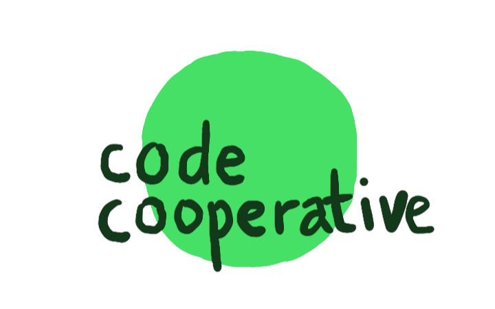
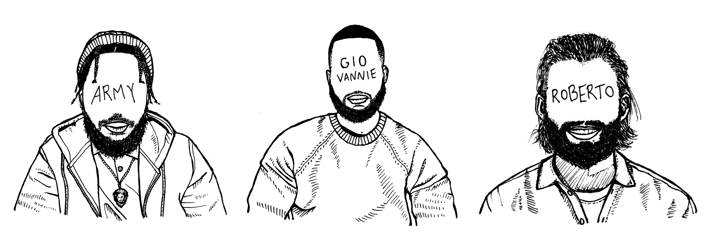
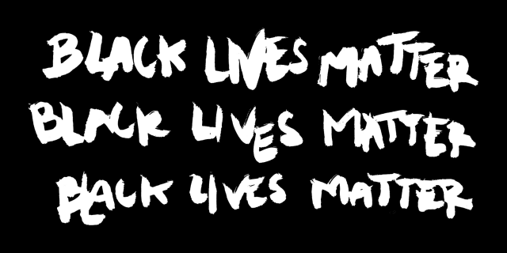

Since our founding in 2018, we have come a long way. We started as a laptop donation program and gradually evolved into a learning community for formerly incarcerated and justice-involved folks in the early stages of their coding careers. 

Over these years we have gifted over 100 laptops and we have provided cost-free tech education for over 200 students in NYC, all because of our amazing tribe of volunteers, donors, and supporters.

Now, we take our next step with a new focus: **paid apprenticeships**. Moving forward, we will not only offer our students opportunities to learn to code, but also give them their first software engineering job. With this new mission comes a new name. 

  <h3>Emergent Works is a nonprofit software company that trains and employs formerly incarcerated people.</h3>

We wouldn’t be here without the work of some incredible people. A big thank you to our Emergent Works Founding Members **Army Armstead** and **Giovannie Hernandez**, who both joined the team in January as recent Emergent Works alumni, and have truly built this organization with me. And while Gio has moved on to bigger things, Army has become Emergent Works’ first Program Manager.

And I am very happy to announce a new addition to the team. **Roberto Goizueta**, who joined us in April to build our agency, is our new Co-founder and Head of Product. Roberto's leadership is what has allowed us to carry out our bold new vision and create work opportunities for our students.

### Hire us! ✨

Yes, you can now hire our amazing team for your software development needs! Check out [/agency](http://emergentworks.org/agency) for more info. And if you or anyone you know is looking to hire a *dope* dev team, reach out to [agency@emergentworks.org](mailto:agency@emergentworks.org). We can't wait to hear from you ❤️

Thank you for being on this journey with us. Keep following us at `@emergentworks_` on [Twitter](http://twitter.com/emergentworks_) and [Instagram](http://instagram.com/emergentworks_) 🙏

  

  <a href="/donate">
    
      Donate to Emergent Works
    
  </a>

  
  

We stand with Jacob Blake and the Black Lives Matter movement now and always.

No one is free until we are all free ❤️

**Alex Qin**  
*Co-founder*  
[Emergent Works](/)
